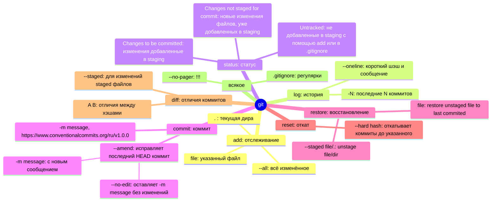

# yandex practicum git-basics
## Todo
Extract git-basics from README to yandex-practicum-git-basics.md

## Правила и практики
- Free MOOC (ru): https://practicum.yandex.ru/git-basics/
- Git howto: https://githowto.com/
- Конвенциональные коммиты: https://www.conventionalcommits.org/ru/v1.0.0/

## command cheatsheat
### git log
https://elijahmanor.com/blog/git-log

### My stuff
```bash
# global and current repo parameters (repo im in)
git config list --global
git config list

# generate key pair with the specified encryption algorithm (ed25519 is strong and keys are compact)
ssh-keygen -t ed25519 -C "youremail@mail"
# then add public key part to GitHub settings, and store private key part in ~/.ssh/ 
# Optionally, configure github host in ~/.ssh/config
# This steps allows you to use GitHub (push) without additional authentication.

# init local repo
git init

# link local repo to remote repo as "origin"
git remote add origin git@github.com:virtua10ne/wannabe_devops.git

# check if there is new (untracked) or modified files
git status

# add file, dir, or all to staging area
git add .
git add <file>
git add --all

# unstage file or dir
git restore --staged <file>
git restore --staged .

# restore changes in unstaged file to last commited version
# if staged use --staged first
git restore <file>

# reset to commit hash
git reset --hard <hash>

# commit changes from staging area
git commit -m "Message to commit with"

# commit something into the last (HEAD) commit
git commit --amend -m "New commit message"
# or without new -m "message"
git commit --amend --no-edit
# used for something you forgot to add and what should be in that same commit

# for the first time: push local commit to master branch of origin repo
git push -u origin master

# for later: just git push
git push
```
## Command mind map (to be updated)



# roadmap.sh ssh-remote-server-setup project results
- Project: https://roadmap.sh/projects/ssh-remote-server-setup  
- GitHub: https://github.com/virtua10ne/wannabe_devops  
  
## Full connection syntax works:
```
ssh -i D:\VMs\YC\VM1\ssh_keys crazydiamond@89.169.151.17  
```
  
## Alias for server is made and connection 'ssh myserv1' works:  
```
Host myserv1  
  Hostname 89.169.151.17  
  User crazydiamond  
  Port 22  
  IdentityFile D:\VMs\YC\VM1\ssh_keys  
  IdentitiesOnly yes  
```
  
## Server up and runnig, Fail2Ban is running:  
```
crazydiamond@compute-vm-2-2-20-hdd-1729889665559:~$ systemctl status fail2ban.service  
● fail2ban.service - Fail2Ban Service  
     Loaded: loaded (/usr/lib/systemd/system/fail2ban.service; enabled; preset: enabled)  
     Active: active (running) since Sat 2024-10-26 07:11:11 UTC; 8min ago  
       Docs: man:fail2ban(1)  
   Main PID: 2800 (fail2ban-server)  
      Tasks: 5 (limit: 2275)  
     Memory: 23.2M (peak: 25.4M)  
        CPU: 672ms  
     CGroup: /system.slice/fail2ban.service  
             └─2800 /usr/bin/python3 /usr/bin/fail2ban-server -xf start  
```
